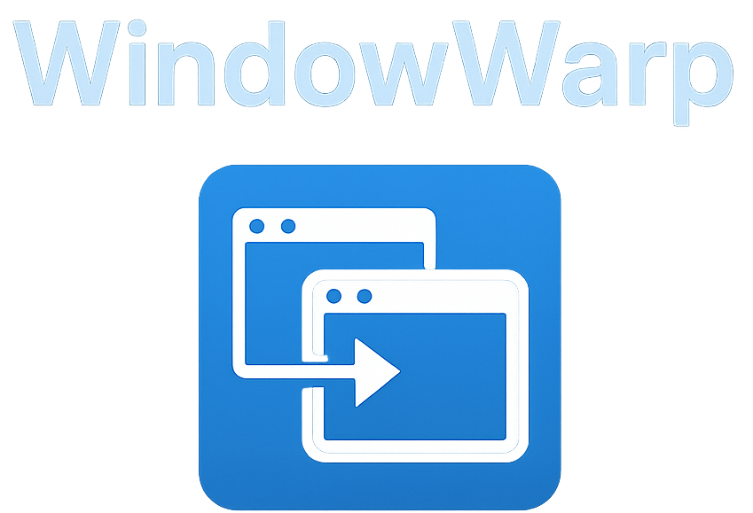

# WindowWarp

Warp Your Links Between Windows — Like Magic.

Ever found yourself juggling two browser windows and thinking, “Why can’t I just send this link to the other one already?” — Yeah, same.

Introducing WindowWarp, the Chrome & Edge extension that makes managing multiple browser windows effortless.

🧩 What It Does:
With WindowWarp, you can:

✅ Instantly select two open browser windows

✅ Right-click any link, and open it directly in the other window

✅ Seamlessly bounce between tasks, tabs, and projects

✅ Stay in your groove without copy-pasting URLs like it’s 1999

⚙️ How It Works:
Click the extension icon to select two windows you want to link.

Right-click any link on a webpage.

Choose which window to open it in — main window or secondary.

Warp complete. 🌀

🎯 Why You’ll Love It:
Ideal for coders, researchers, multitaskers, and chaos-tab survivors

Clean interface, fast performance, zero bloat

Doesn’t track your data (because ew, privacy matters)

🔒 Permissions? Minimal.
We only request what’s needed to:

Read links you click

Open tabs in other windows

We don’t collect, store, or sell anything. Period.

🧪 Still in Beta — Your Feedback = Gold
Help shape the future of WindowWarp! Got an idea? Hit us up. We’re constantly improving based on what you need.

👉 Get it on Microsoft Edge Add-ons

